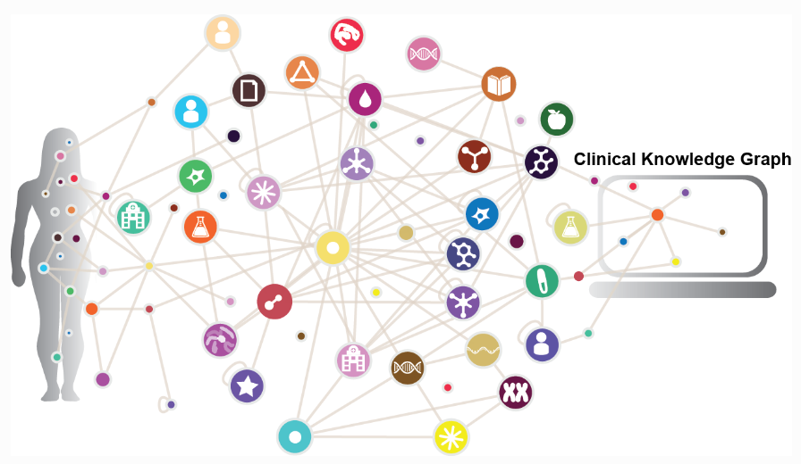

# DATA FOUNDATION SYSTEMS

# Healthcare Knowledge Graph

## Team - Dr. Data

**Members:** 

- Sarthak Bansal - 2021101134
- Krishna Singh - 2021112005
- Deeptansh Sharma - 2021102011

### **Intuition**

The promise of precision medicine is to deliver personalized treatment based on each patient’s unique physiology. This concept was fueled by the genomic revolution, but it is now evident that integrating other types of omics data, like proteomics, into the clinical decision-making process will be essential to accomplish precision medicine goals. However, the the quantity and diversity of biomedical data and the spread of clinically relevant knowledge across various biomedical databases and publications make this exceptionally difficult. To address this, we need to incorporate shared learning and develop visual and graphical interfaces to link and analyze this data which is scattered at multiple fronts.

### **Overview**

The project aims to develop a comprehensive Healthcare Knowledge System tailored for patients, offering a layered approach to organize and present crucial healthcare data. This system will empower patients to better understand and manage their health by providing access to various categories of healthcare information.

The project's overarching goal is to provide patients with a user-friendly interface that allows them to access and comprehend their healthcare data easily. By offering this layered approach, patients can navigate through their medical information intuitively, gaining insights into their health status, progress, and potential risks.



The project is divided into two phases viz. Phase I and Phase II.

### **Phase I**

### Functional Requirements

Phase I involves developing a prototype of a Knowledge Graph for the HealthCare datasets provided on the following link: [https://ckg.readthedocs.io/en/latest/INTRO.html](https://ckg.readthedocs.io/en/latest/INTRO.html)

The data resources are compiled and listed down below-

| Source type | Source | URL | Reference |
| --- | --- | --- | --- |
| Database | UniProt | https://www.uniprot.org/ | https://www.ncbi.nlm.nih.gov/pubmed/29425356 |
| Database | TISSUES | https://tissues.jensenlab.org/ | https://www.ncbi.nlm.nih.gov/pubmed/29617745 |
| Database | STRING | https://string-db.org/ | https://www.ncbi.nlm.nih.gov/pubmed/30476243 |
| Database | STITCH | http://stitch.embl.de/ | https://www.ncbi.nlm.nih.gov/pubmed/26590256 |
| Database | SMPDB | https://smpdb.ca/ | https://www.ncbi.nlm.nih.gov/pubmed/24203708 |
| Database | SIGNOR | https://signor.uniroma2.it/ | https://www.ncbi.nlm.nih.gov/pubmed/31665520 |
| Database | SIDER | http://sideeffects.embl.de/ | https://www.ncbi.nlm.nih.gov/pubmed/26481350 |
| Database | RefSeq | https://www.ncbi.nlm.nih.gov/refseq/ | https://www.ncbi.nlm.nih.gov/pubmed/26553804 |
| Database | Reactome | https://reactome.org/ | https://www.ncbi.nlm.nih.gov/pubmed/31691815 |
| Database | PhosphoSitePlus | https://www.phosphosite.org/ | https://www.ncbi.nlm.nih.gov/pubmed/25514926 |
| Database | Pfam | https://pfam.xfam.org/ | https://www.ncbi.nlm.nih.gov/pubmed/30357350 |
| Database | OncoKB | https://www.oncokb.org/ | https://www.ncbi.nlm.nih.gov/pubmed/28890946 |
| Database | MutationDs | https://www.ebi.ac.uk/intact/resources/datasets#mutationDs | https://www.ncbi.nlm.nih.gov/pubmed/30602777 |
| Database | Intact | https://www.ebi.ac.uk/intact/ | https://www.ncbi.nlm.nih.gov/pubmed/24234451 |
| Database | HPA | https://www.proteinatlas.org/ | https://www.ncbi.nlm.nih.gov/pubmed/21572409 |
| Database | HMDB | https://hmdb.ca/ | https://www.ncbi.nlm.nih.gov/pubmed/29140435 |
| Database | HGNC | https://www.genenames.org/ | https://www.ncbi.nlm.nih.gov/pubmed/30304474 |
| Database | GwasCatalog | https://www.ebi.ac.uk/gwas/ | https://www.ncbi.nlm.nih.gov/pubmed/30445434 |
| Database | FooDB | https://foodb.ca/ |  |
| Database | DrugBank | https://www.drugbank.ca/ | https://www.ncbi.nlm.nih.gov/pubmed/29126136 |
| Database | DisGeNET | https://www.disgenet.org/ | https://www.ncbi.nlm.nih.gov/pubmed/25877637 |
| Database | DISEASES | https://diseases.jensenlab.org/ | https://www.ncbi.nlm.nih.gov/pubmed/25484339 |
| Database | DGIdb | http://www.dgidb.org/ | https://www.ncbi.nlm.nih.gov/pubmed/29156001 |
| Database | CORUM | https://mips.helmholtz-muenchen.de/corum/ | https://www.ncbi.nlm.nih.gov/pubmed/30357367 |
| Database | Cancer Genome Interpreter | https://www.cancergenomeinterpreter.org/ | https://www.ncbi.nlm.nih.gov/pubmed/29592813 |
|  |  |  |  |
| Ontology | Disease Ontology | https://disease-ontology.org/ | https://www.ncbi.nlm.nih.gov/pubmed/30407550 |
| Ontology | Brenda Tissue Ontology | https://www.brenda-enzymes.org/ontology.php?ontology_id=3 | https://www.ncbi.nlm.nih.gov/pubmed/25378310 |
| Ontology | Experimental Factor Ontology | https://www.ebi.ac.uk/efo/ | https://www.ncbi.nlm.nih.gov/pubmed/20200009 |
| Ontology | Gene Ontology | http://geneontology.org/ | https://www.ncbi.nlm.nih.gov/pubmed/27899567 |
| Ontology | Human Phenotype Ontology | https://hpo.jax.org/ | https://www.ncbi.nlm.nih.gov/pubmed/27899602 |
| Ontology | SNOMED-CT | http://www.snomed.org/ | https://www.ncbi.nlm.nih.gov/pubmed/27332304 |
| Ontology | Protein Modification Ontology | https://www.ebi.ac.uk/ols/ontologies/mod | https://www.ncbi.nlm.nih.gov/pubmed/23482073 |
| Ontology | Molecular Interactions Ontology | https://www.ebi.ac.uk/ols/ontologies/mi | https://www.ncbi.nlm.nih.gov/pubmed/23482073 |
| Ontology | Mass Spectrometry Ontology | https://www.ebi.ac.uk/ols/ontologies/ms | https://www.ncbi.nlm.nih.gov/pubmed/23482073 |
| Ontology | Units Ontology | https://bioportal.bioontology.org/ontologies/UO | https://www.ncbi.nlm.nih.gov/pubmed/23060432 |
- The features from these varied datasets will be collated under proper headers to make a single data file.
- These features will be classified and ordered according to their importance after finding their correlation with each other.
- Highly correlated features will be assigned a Parent Node/Child Node I/Child Node II based on how highly they rank.
- Features will less importance will form the leaf nodes or be adjusted in intrinsic data of other nodes.
- Based on the final results a Knowledge Graph will be prepared as a prototype

### Queries

Further multiple Graph Queries will be formulated based on the Knowledge Graph Data and modelled on projections to see how efficiently the related data is extracted.

Based on query results the graph can be made more efficient to reduce noise in the output results, that is avoid irrelevant results in the output.

Example:

What kind of drugs are recommended to patients with Stage II blood cancer?

What is the cause of 50 year old male, weighing 102 kg to get high blood pressure?

### Model of a potential Knowledge Graph


### **Phase II**

Phase II of our project involves transforming the data into a format provided by the Data Foundation and Healthcare Team. This phase builds upon the work done in Phase I, where we developed a prototype of a Knowledge Graph for Healthcare datasets.

1. **Data Format Alignment**:
    - Examining the specific data format requirements provided by the Data Foundation and Healthcare Team. Ensuring that we have a clear understanding of their expectations for how the data should be structured and organized.
2. **Feature Re-Identification**:
    - Review the features that were identified and categorized in Phase I. These features were classified and ordered based on their importance and correlation with each other.
    - Re-evaluate the importance of each feature in the context of the new data format requirements. Some features that were considered important in Phase I might need to be adjusted or even excluded if they do not align with the new format.
    - Identify any additional features that may be required by the Data Foundation and Healthcare Team to meet their specific needs.
3. **Node Assignment**:
    - Reassign parent and child nodes based on the new data format. The hierarchy of nodes in your Knowledge Graph may need to be adjusted to match the structure expected by the stakeholders.
    - Considering how the features will be organized within the Knowledge Graph. Some highly correlated features may need to be grouped together, while others may become leaf nodes or be incorporated into the intrinsic data of other nodes as necessary.
4. **Data Transformation**:
    - Begin the process of transforming the data to adhere to the new format. This may involve reformatting columns, creating new data structures, or adjusting the relationships between different features and nodes.
    - Ensuring that the data transformation process is carried out accurately and efficiently to meet the requirements of the Data Foundation and Healthcare Team.
5. **Validation**:
    - As we make changes to the data structure and node assignments, it's essential to validate and test the new format to ensure that it meets the desired objectives and maintains data integrity.
    - Verifying that the relationships between features and nodes align with the expectations of the stakeholders.
6. Integrating:
    - Integrating the Graphical Models with our own interface.
    - Writing corresponding back-end queries.
    - Modifying user interface, if required.
7. Testing:
    - Testing the interface thoroughly so that the system and interface is stable and does not crash.
8. **Documentation**:
    - Document the changes made during Phase II thoroughly. This documentation should include details about the new data format, feature re-identification, and node assignments.
    - Create clear guidelines for future data management and updates to ensure that the Knowledge Graph remains aligned with the expectations of the Data Foundation and Healthcare Team.

### **Non-Functional Requirements**

- We will be using Neo4Js which may not be compatible with certain browsers as of now.
- Graphical queries are relatively fast and can provide real time performance.
- As the size of database increases , it may be difficult to categorise them into generalised entities and therefore , we may have to do pruning.
- Personal data of patients may not be given , however , for our purposes , anonymous data is sufficient.

### **Interface**

A sample visualization using the interface tool chosen for the project.

### Initialization of Database


### Knowledge Graph


### User Queries


## **Setup**
The repository can be set up in a usual fashion as any other webapp .

***Cloning the repo***
```C
git clone https://github.com/jayghevariya/Healthcare-Knowledge-Graph_Dr.Data.git
```

***Installing dependencies***

Frontend
```
cd frontend
npm i
```

Backend
```
cd backend
npm i
```

***Starting servers***

Frontend
```
cd frontend
npm start
```

Backend
```
cd backend
nodemon server.js
```

After everything , you can open the app in localhost:3000 and backend server will be operable at localhost:3001